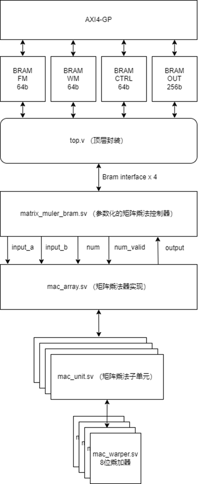

# 原设计改进点

在仔细理解了原设计的设计思路和原理后，仔细思考了其可能的改进点。基于这些可能的改进点，从零开始构建了一套矩阵乘法加速器，并成功通过了PS侧的随机数据测试验证。

后续仍有一些改进点暂未尝试实现，已实现的为以下这六点

## 改进一：输入对齐

由于脉动乘法器的设计特点，原始设计中的input align fifo实际是可以使用多级寄存器替代。

在进行计算时候，后一列数据的输入要求滞后前一列的数据一个周期，因此对于第一列的输入，不使用寄存器，第二列的输入上加一级寄存器，第三列的输入上加入两级寄存器，以此类推。每一级寄存器可以滞后数据一个周期，按照这种方式给每一列的数据输入加上不同级数的寄存器，就完成了数据的align操作，并不需要单独的fifo实现。

对于每一行的输入数据也是同理。

这样实现的对齐模块，可以有效的降低设计复杂度和资源占用情况，不再需要额外的fifo ip核心，且非常易于参数化实现。

## 改进二：矩阵乘法输出处理

对于脉动矩阵乘法的输出，现有设计中，8x8的矩阵乘法单元输出上也使用和输入类似的级联设计，每周期平均只能输出4个有效数据，故完整的64个数据需要16个周期才可以输出。

如果在输出上使用一个8选1的mux替代原有的输出方式，则在不明显增加资源占用和延迟的情况下，每周期可以输出8个数据，使得完整的64个数据能在8个周期内完成输出。

## 改进三：输出对齐

综合改进一与改进二，现在8x8矩阵乘法器的输出，类似其输入，很容易对齐。

第一行，第一列的元素是第一个完成计算的，同行下一列的元素，则会在下个周期就绪。因此在输出时候，对第一列位置加7级寄存器到最终输出，对第二列位置，加6级寄存器到最终输出，以此类推。这样一来，最终输出就一定是8个结果对齐的。这可以节约多个fifo ip和一系列bram的使用。

 

## 改进四：提高乘法器吞吐量

原始设计中，矩阵乘法的运算是多周期的。下一次矩阵乘法运算会等待上一次运算的结果存好后再开始。实际上，如果应用了上述改进三中的设计，则矩阵乘法操作可以连续执行，不需要等待上一次结果完成输出。

8x8矩阵乘法器，执行的是8xn nx8两个矩阵之间的乘法，实际执行需要的周期由n决定。在使用了改进三中的设计后，对于每一个矩阵乘法，输入这边，复位需要一个周期，数据读入需要n个周期，输出需要8个周期。当n小于等于7时，矩阵乘法可以在8个周期内流水式的完成。上一个乘法不需要完全停止，就可以读取下一个矩阵乘法的数据开始运算。故此时矩阵乘法吞吐量为1/8 cycle。当n大于等于8时，由于乘法阵列的复位需要一个周期，故矩阵乘法的吞吐量下降为1/(n+1) cycle。相比原始设计，原始设计的数据需要16个周期读出，吞吐量最高为1/16 cycle，是有大幅度的提高的。

若要支持连续的矩阵乘法，在控制器部分也需要大量的重写逻辑，使得子矩阵计算时，输入与输出逻辑分离，输入不需要等待输出完成，保证最大的可能吞吐量。

## 改进五：优化MAC模块资源占用

原始设计的MAC.v内的MAC模块，对于横向数据和纵向数据，分别加入了w_valid和f_valid信号，对于全局还有一个num_valid，rst信号，实际上这部分信号是冗余的。

这四组有效信号可以完全只由一个num_valid完成替代，当num_valid拉高时，它充当一个类似reset信号的功能，重置乘加器内部的寄存器，设置内部的num_r寄存器为输入的num_r值。当输入数据有效时，再拉低num_valid信号，乘加器自动开始计数，在指定周期内完成乘法的运算要求。

​    在整个矩阵乘法整列中，将外部的num_valid信号只接入左上角的第一个乘加模块，后续模块的num_valid信号接入左侧或者上方乘加模块的num_valid_r输出，且保证最终所有模块在同一个连接图内，即可。这样可以节约乘法器的四组输入与三组输出，有利于减少最终使用的资源。由于这样的整列会重复64次，这些细节的节约，对最终是会有比较大的影响的。

## 改进六：参数化

原始设计中，所有连线为写死的硬连线，不是非常灵活。如果需要将乘加器位宽扩大为16，切换为浮点，或者修改乘加器内部逻辑，乘加器延时，或者脉动整列规模，都是非常的麻烦。

使用system verilog的参数化功能，可以有效的避免非常多重复的，机械性质的连线，且可以快速的产生不同配置，适用不同的应用场景。

# 验证实现

## 架构描述

依照上述六个改进点，独立于原始代码实现并验证了一套矩阵乘法加速器。此实现的源码位于此压缩包的rtl目录下，实现工程位于压缩包的lab5文件夹中，打开工程后需要重新导入一次rtl目录下的原码。综合后的比特流，搭配使用的修改后的Matmul.py文件也在压缩包中。在PS-PL交互方面，与原始设计逻辑基本一致，只是额外要求数据8对齐，并要求数据8对齐的读回。

整体架构如图，精简了大量原始设计中的模块：

此实现主要使用system verilog，包括矩阵乘法器规模在内的大量参数均为可配置的，目前使用的乘法规模配置为8x8，位数为8位，乘法器为单周期，尚未对其他配置进行充分测试验证。

矩阵乘法指令的整体控制执行在matrix_muler_bram.sv中实现，主要逻辑为两类，分别是对子矩阵的拆分控制，和当前运行子矩阵输入输出地址的管理。

矩阵乘法在mac_array.sv中实现，此模块高度的参数化，可以在不同参数下生成出不同的乘法模块来。

8位乘加器被单独分隔到mac_warper.sv中，可以使用不同设计的乘法器，或者乘法ip核心替代该模块以进一步提高性能或者减小占用。如果需要修改数据类型，也可通过替换此模块并修改一些参数来实现。

## 资源占用

实现后的资源占用如图，上图为参考实现，下图为改进实现：

（注：参考实现使用了8x16的规模，改进实现配置为8x8）

虽然两个实现规模并不一致，但可以看到对于矩阵乘法单元的资源占用，改进实现从原先的约11488个LUT降低到了9253个LUT，有比较明显的资源占用优化。

## 性能对比

在python测试中的性能对比（使用32x1024 1024x128的乘法规模，接近bram极限），上图为参考实现，下图为改进实现，分别记录并打印了等待flag=0信号的时间。

(注：参考实现使用了8x16的乘法规模，改进实现配置为8x8）

改进实现在只有一半乘法器规模的情况下，做到了比原始设计更快的计算速度。可能得益于对计算流程的简化，减少了大量的数据改变位宽操作的延时。流水化的矩阵乘法，也可也提高一定的性能。

# 后续可能的改进点

## 后续改进点一：乒乓模式

当前若要进行一次矩阵乘法，就需要从cpu向矩阵乘法加速器的buffer搬运一次数据，并搬回一次，这个过程是完全串行的，即

cpu搬运数据 -> cpu设置inst,flag -> 乘法器运算 -> cpu读取flag -> cpu搬运结果

这个过程可以进行一定的时间压缩，比如设置不同的buffer区域，使得乘法器在运算的同时，cpu可以准备下一次运算的数据，在乘法器完成运算，进入下一个运算的时候，cpu读取上一次运算的结果，即为乒乓模式。这样以来，就使得任务在一定程度上并行了，可以提高模块的整体吞吐量和效率。

## 后续改进点二：DMA

当前的加速模块，使用AXI-GP与PS侧通讯。但是AXI-GP的通讯效率较低，cpu将数据写入到AXI-GP需要绕过内部的Cache，写入效率也并不高。

ZYNQ实现上，为其ARM核加入了一个AXI-ACP接口，该接口直连CPU核的SCU，拥有高性能以及与CPU核心的缓存一致性。如果在PL侧实现一个DMA，通过配置寄存器指定内存中数据的地址，由DMA将对应数据直接搬运到PL侧的bram，计算完成后再搬运回去。这样实现可以大幅度的提高PL与PS侧的通讯性能，且尽可能的使用片上的l2 cache提高性能，尽量不使io变成系统的性能瓶颈。